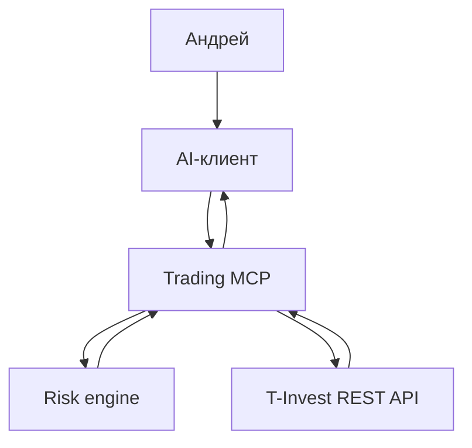

# Архитектура

## Принцип

Языковая модель объясняет данные и рассматривает сценарии. Детерминированный код получает брокерские данные, считает деньги и применяет ограничения. MCP остаётся read-only; отдельный Telegram-executor может отправить подтверждённое поручение только в песочницу T-Invest.

## Разделение счетов

Каждая операция с портфелем принимает не произвольный номер счёта, а роль `intraday` или `swing`. Настоящий `accountId` берётся только из локальной конфигурации. Это уменьшает риск перепутать счета и не раскрывает их модели без необходимости.

## Рыночный контекст

Перед расчётом сделки агент должен разрешить тикер в идентификатор T-Invest, проверить статус торгов и получить рыночный снимок: последнюю цену и стакан. Стакан используется для оценки спреда и ликвидности, но не трактуется как самостоятельный сигнал на вход.

## Анализ свечей

`analyze_candles` исключает незакрытые и некорректные свечи, затем рассчитывает SMA(20), SMA(50), ATR(14) и относительный объём. При недостатке истории она возвращает недоступные показатели как `null` и предупреждения, а не подставляет предположения. Эти числа описывают рыночный контекст и не являются самостоятельным сигналом на покупку или продажу.

## Карточка сценария

`prepare_trade_scenario` параллельно загружает свечи, последнюю цену, стакан и статус торгов. Затем детерминированный код рассчитывает торговый план и возвращает `candidate`, `review` или `blocked`. `candidate` — это только допуск к ручному рассмотрению, а не команда на сделку. В ответе всегда есть список блокеров и предупреждений.

Лимиты спреда и расхождения планируемого входа с рынком задаются отдельно для `intraday` и `swing` через локальный `.env`. Short отключён по умолчанию и не может быть использован случайно.

## Локальный журнал сценариев

`record_trade_scenario` создаёт свежую карточку, а затем записывает безопасный снимок в локальный SQLite. В него входят параметры сценария, результат расчёта, анализ свечей, состояние рынка, блокеры и предупреждения; токен, номер счёта и сырые ответы T-Invest не записываются. Это локальная операция аудита, не брокерская команда. `list_recorded_scenarios` читает журнал без сетевого запроса.

## Paper trading

`open_paper_trade` и `close_paper_trade` изменяют только локальную SQLite-базу. Открытие доступно исключительно для сохранённого `candidate` и требует булево подтверждение в вызове инструмента; закрытие — такое же отдельное подтверждение. Обе операции получают последнюю цену T-Invest, моделируют неблагоприятное проскальзывание в цене исполнения и рассчитывают комиссию для каждой стороны. Одна карточка сценария допускает не более одной бумажной сделки.

## Отчёт paper trading

`get_paper_report` читает только закрытые paper-сделки из SQLite и никогда не обращается к брокеру. Он строится на скользящих 24 часах или 7 днях и возвращает валовой и чистый результат, модельные комиссии, проскальзывание, win rate, profit factor и предупреждение о недостаточной выборке. Отчёт не трактуется как доказательство преимущества стратегии.

## Intraday-сканер

Локальный процесс `scan:intraday` не открывает брокерские или paper-позиции. Он запускается отдельно от MCP, каждые пять минут обрабатывает только заданный в `.env` watchlist и сохраняет `candidate` не чаще заданного cooldown. Условия первой эвристики прозрачны и намеренно просты: 5-минутный `up`-тренд, относительный объём от 1.0, стоп от ATR, цель 2.5R. Это механизм сбора paper-выборки, а не доказанная стратегия.

## Telegram control plane

Telegram-сервис запускает тот же intraday-сканер и получает обновления через long polling: приложению не нужен входящий HTTP-порт или публичный webhook. Он принимает команды только из явного allowlist chat ID. Доступны только просмотр статуса и кандидатов, а также сохранённая в SQLite пауза/продолжение сканера. При новом `candidate` сервис отправляет авторизованным чатам краткую карточку.

Позиция чтения Telegram-обновлений хранится в SQLite, поэтому после перезапуска уже обработанные команды не повторяются. Сканер автоматически формирует pending-поручение из нового `candidate`, но сетевой вызов происходит только после `/approve ID CONFIRM` из allowlisted-чата.

## Изолированное sandbox-исполнение

Trading token передаётся только отдельному `TInvestOrderClient`; read-only `TInvestClient` его не видит. Executor повторно проверяет свежесть кандидата и рынок, применяет дневной лимит числа заявок и расчётного риска, атомарно переводит запись в `submitting` и отправляет лимитную FOK-заявку без согласия на маржу.

`scenario_id` и idempotency UUID уникальны. При сетевой неопределённости статус остаётся `submitting`, а повторное подтверждение отправляет тот же UUID. Состояние поручения и отдельные append-only события сохраняются в SQLite. Kill switch по умолчанию включён и переживает рестарт.

Sandbox-счёт создаётся и пополняется виртуальными рублями при первой команде `/execution_arm SANDBOX`; его ID хранится только в локальном журнале. Endpoint реальных заявок в модуле отсутствует.

## Контейнерный запуск

Контейнеру не публикуются порты: он устанавливает только исходящие HTTPS-соединения с Telegram и T-Invest. SQLite выносится в именованный Docker volume, а корневая файловая система контейнера доступна только для чтения. При T-Invest используются стандартная проверка TLS и системный `curl` с доверенной цепочкой CA; отключение проверки сертификатов запрещено.

## Следующая граница

Перед реальными сделками нужны автоматические защитные выходы, reconciliation после перезапуска и сетевых сбоев, фактический дневной PnL/лимит убытка и приёмка на достаточной sandbox-выборке. До этого live-endpoint намеренно отсутствует.
