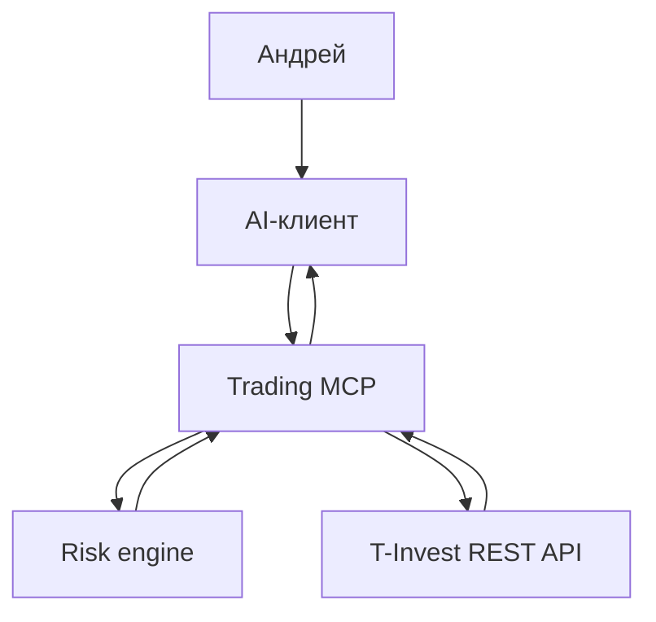

# Архитектура

## Принцип

Языковая модель объясняет данные и рассматривает сценарии. Детерминированный код получает брокерские данные, считает деньги и применяет ограничения. В версии 0.1 между MCP и T-Invest API нет команд выставления заявок.

## Разделение счетов

Каждая операция с портфелем принимает не произвольный номер счёта, а роль `intraday` или `swing`. Настоящий `accountId` берётся только из локальной конфигурации. Это уменьшает риск перепутать счета и не раскрывает их модели без необходимости.

## Следующая граница

Перед реальными сделками появится отдельный модуль исполнения. Он не будет переиспользовать read-only токен и потребует явного подтверждения, idempotency key, журнал аудита, дневной лимит убытка и аварийную блокировку.
